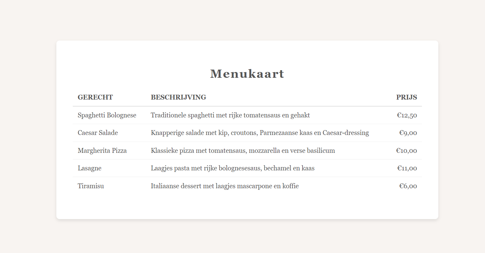

# AltunIT | Tabellen

# Menukaart met Tabellen

Deze webpagina is een oefening in het opbouwen van tabellen met HTML. Het doel van dit project is om je te laten oefenen met de structuur en het gebruik van tabellen in HTML, waaronder de tags table, tr, th, en td. Om het project visueel aantrekkelijker te maken, is er een eenvoudige opmaak toegevoegd. In het volgende hoofdstuk zullen we dieper ingaan op CSS-styling en de mogelijkheden om de opmaak verder aan te passen.

## Inhoud

- Table: De hoofdstructuur voor het creëren van tabellen. Binnen de table-tag voegen we rijen en kolommen toe.
- Tr: Staat voor "table row" en wordt gebruikt om rijen in de tabel te definiëren.
- Th: Staat voor "table header" en wordt gebruikt om kolomkoppen te maken. In dit project gebruiken we th voor de kolommen ‘Gerecht’, ‘Beschrijving’, en ‘Prijs’.
- Td: Staat voor "table data" en wordt gebruikt om de gegevens in elke rij en kolom weer te geven. Elke cel met inhoud in de tabel wordt gedefinieerd door een td tag.

### Opmerking over Visuele Opmaak

Hoewel we de focus hebben gelegd op HTML-structuur, is er een basisvisuele opmaak toegevoegd om de tabel aantrekkelijker te maken. Deze opmaak biedt een voorproefje van wat mogelijk is met CSS. In het volgende hoofdstuk zullen we dieper ingaan op CSS-styling, zodat je leert hoe je de opmaak verder kunt aanpassen en verfijnen.

Voor nu ligt de nadruk op de HTML-structuur en het gebruik van tabellen, terwijl we in de toekomst terugkomen op de mogelijkheden met CSS.

## Eindresultaat
Het eindresultaat is een overzichtelijke tabel die gerechten met beschrijvingen en prijzen weergeeft. De eenvoudige opmaak maakt het project visueel aantrekkelijk en functioneel.

